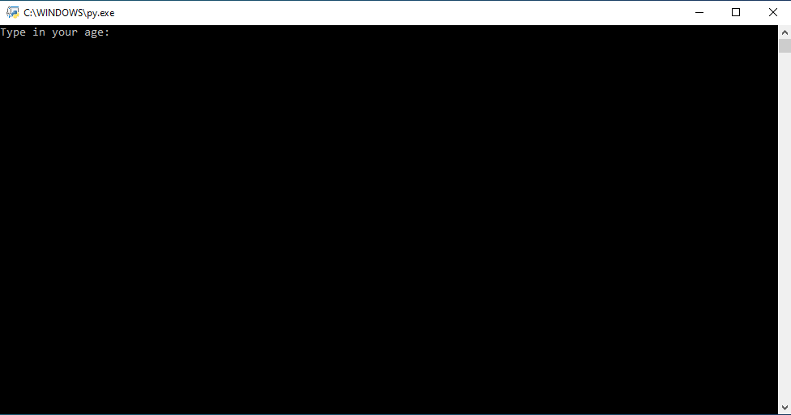

# age-groups
Simple script which takes age of a person as an input and prints coresponding age group as an output.

The age groups are:
- Child: 0 to 11
- Teen: 12 to 17
- Adult: 18+

Live demo [_here_](https://replit.com/@BartlomiejLis/age-groups).

## Table of Contents
* [Tech Stack](#tech-stack)
* [Screenshots](#screenshots)
* [Run Locally](#run-locally)
* [Project Status](#project-status)
* [Authors](#authors)

## Tech Stack
- Python

## Screenshots


## Run Locally
Clone the project

```bash
  git clone https://github.com/bartlomiejlis/age-groups.git
```

Go to the project directory and run main.py with Python.

The program works in text form. Follow instructions on your screen to start using it.

## Project Status
Project is: _no longer being worked on_.

## Authors
Created by Bartłomiej Lis - feel free to contact me at lisu.b117@gmail.com!
